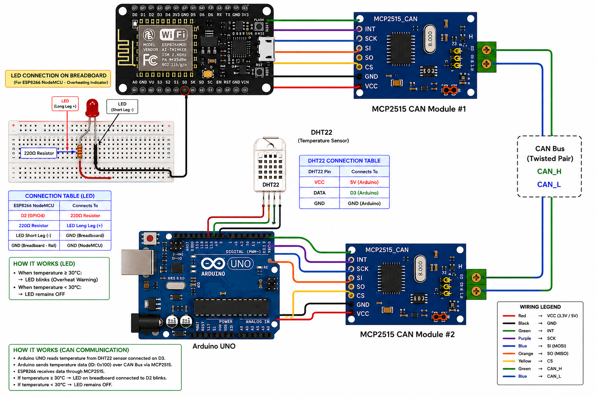
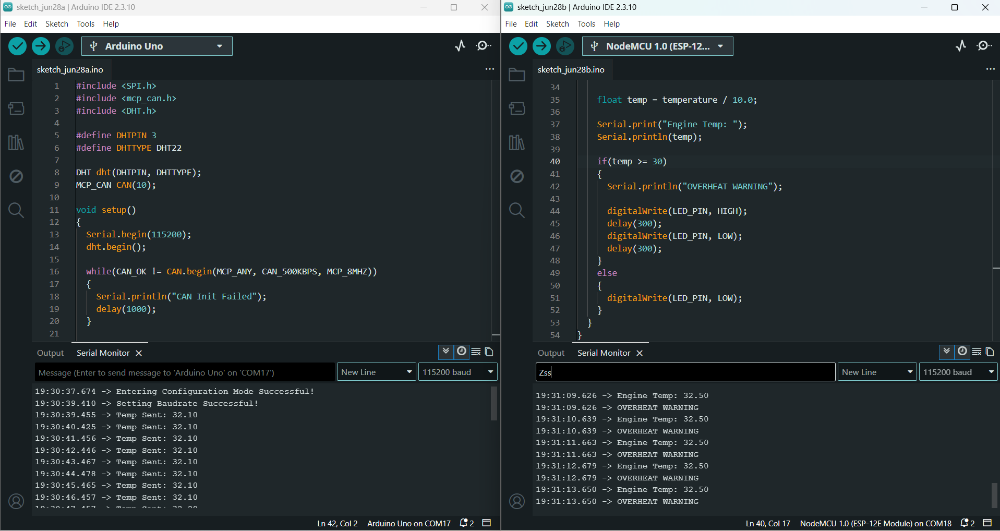

# Arduino–ESP8266 CAN-Based Temperature Monitoring System

## 📖 Project Overview

This project implements a **CAN Bus-based Temperature Monitoring System** using an **Arduino Uno**, an **ESP8266 NodeMCU**, **two MCP2515 CAN Bus modules**, and a **DHT22 Temperature Sensor**.

The system is designed to monitor temperature in real time. The Arduino Uno reads the temperature from the DHT22 sensor and transmits the data to the ESP8266 over the CAN Bus. The ESP8266 receives the temperature, displays it on the Serial Monitor, and compares it with a predefined threshold value. If the measured temperature is **30°C or higher**, the ESP8266 activates an LED as an overheat warning.

This project demonstrates sensor interfacing, CAN Bus communication, real-time data transmission, and threshold-based monitoring in embedded systems.

---

# 🎯 Project Objectives

* Interface a DHT22 sensor with the Arduino Uno.
* Read temperature data from the sensor.
* Transmit temperature data using CAN Bus communication.
* Receive CAN messages on the ESP8266.
* Display the received temperature on the Serial Monitor.
* Blink an LED whenever the temperature exceeds the predefined threshold.
* Demonstrate reliable communication between two embedded devices using CAN Bus.

---

# ✨ Features

* Real-time temperature monitoring
* CAN Bus communication using MCP2515 modules
* Arduino Uno as CAN transmitter
* ESP8266 NodeMCU as CAN receiver
* Automatic LED overheat warning
* Temperature updates every second
* Reliable communication at **500 kbps**

---

# 🛠 Hardware Components

| Component                |    Quantity |
| ------------------------ | ----------: |
| Arduino Uno              |           1 |
| ESP8266 NodeMCU          |           1 |
| MCP2515 CAN Module       |           2 |
| DHT22 Temperature Sensor |           1 |
| LED                      |           1 |
| 220Ω Resistor            |           1 |
| Breadboard               |           1 |
| Jumper Wires             | As Required |
| USB Cable                |           2 |

---

# 💻 Software Requirements

* Arduino IDE
* ESP8266 Board Package
* MCP_CAN Library
* SPI Library
* DHT Library

---

# 🔌 Hardware Connections

## Arduino Uno Connections

### DHT22 Sensor

| DHT22 | Arduino Uno |
| ----- | ----------- |
| VCC   | 5V          |
| GND   | GND         |
| DATA  | D3          |

### MCP2515 Module

| MCP2515 | Arduino Uno |
| ------- | ----------- |
| VCC     | 5V          |
| GND     | GND         |
| CS      | D10         |
| SO      | D12         |
| SI      | D11         |
| SCK     | D13         |

---

## ESP8266 NodeMCU Connections

### MCP2515 Module

| MCP2515 | ESP8266 |
| ------- | ------- |
| VCC     | VIN     |
| GND     | GND     |
| CS      | D8      |
| SO      | D6      |
| SI      | D7      |
| SCK     | D5      |

### LED

| ESP8266 | Component                   |
| ------- | --------------------------- |
| D2      | LED (through 220Ω resistor) |

---

# ⚙️ CAN Configuration

| Parameter             | Value    |
| --------------------- | -------- |
| CAN Identifier        | 0x100    |
| CAN Speed             | 500 kbps |
| Crystal Frequency     | 8 MHz    |
| CAN Mode              | Normal   |
| Transmission Interval | 1 Second |
| Data Length           | 2 Bytes  |

---

# 📦 CAN Data Format

The Arduino transmits **2 bytes** of data.

| Byte   | Description              |
| ------ | ------------------------ |
| Byte 0 | High byte of temperature |
| Byte 1 | Low byte of temperature  |

The temperature value is multiplied by **10** before transmission to preserve one decimal place.

Example:

```text
Temperature = 28.5°C

Transmitted Value = 285
```

The ESP8266 reconstructs the original temperature using:

```cpp
temperature = (buf[0] << 8) | buf[1];
temp = temperature / 10.0;
```

---

# 🔄 System Workflow

1. The DHT22 sensor measures the ambient temperature.
2. Arduino Uno reads the temperature from the sensor.
3. The temperature is multiplied by 10 and converted into two bytes.
4. Arduino transmits the temperature using CAN ID **0x100**.
5. ESP8266 continuously listens for incoming CAN messages.
6. The received temperature is reconstructed from the two bytes.
7. The temperature is displayed on the Serial Monitor.
8. If the temperature is **30°C or higher**, the LED blinks as an overheat warning.
9. Otherwise, the LED remains OFF and monitoring continues.

---

# 📡 System Architecture

```text
          DHT22 Sensor
               │
               ▼
         Arduino Uno
               │
        MCP2515 CAN Module
               │
═══════════ CAN Bus ═══════════
               │
        MCP2515 CAN Module
               ▼
       ESP8266 NodeMCU
               │
               ▼
      Temperature Processing
               │
      ┌────────┴─────────┐
      │                  │
      ▼                  ▼
 Temp < 30°C        Temp ≥ 30°C
  LED OFF            LED Blinks
```

---

# 📂 Project Structure

```text
Arduino_ESP8266_DHT22
│
├── Arduino_Code
├── ESP8266_Code
├── Circuit_Diagram
├── Images
└── README.md
```

---

# ⚙️ Setup Instructions

1. Connect the DHT22 sensor to the Arduino Uno.
2. Connect an MCP2515 module to the Arduino Uno.
3. Connect another MCP2515 module to the ESP8266.
4. Connect CANH to CANH and CANL to CANL between both modules.
5. Connect an LED to GPIO D2 on the ESP8266 through a 220Ω resistor.
6. Upload the transmitter code to the Arduino Uno.
7. Upload the receiver code to the ESP8266.
8. Open the Serial Monitor at **115200 baud**.
9. Observe the transmitted temperature values and verify LED operation when the temperature reaches or exceeds **30°C**.

---

# 📷 Circuit Diagram



---

# 📸 Project Images



---

# 📊 Sample Output

### Arduino Uno

```text
Temp Sent: 28.6
Temp Sent: 29.4
Temp Sent: 30.2
```

### ESP8266

```text
Engine Temp: 28.6
Engine Temp: 29.4
Engine Temp: 30.2

OVERHEAT WARNING
```

---

# ✅ Results

The project successfully demonstrated real-time temperature monitoring using CAN Bus communication. The Arduino Uno continuously transmitted temperature readings from the DHT22 sensor to the ESP8266 through the MCP2515 CAN modules. The ESP8266 accurately reconstructed the received temperature values and displayed them on the Serial Monitor. When the received temperature reached or exceeded **30°C**, the LED blinked successfully, indicating an overheat condition.

The project validates the use of CAN Bus for reliable communication between embedded devices and demonstrates a simple threshold-based monitoring and alert system.

---

# 🌍 Applications

* Industrial Temperature Monitoring
* Embedded CAN Networks
* Smart Factory Monitoring
* Automotive Temperature Monitoring
* IoT Gateway Development
* Environmental Monitoring Systems

---

# 📚 Skills Demonstrated

* Arduino Programming
* ESP8266 Programming
* CAN Bus Communication
* MCP2515 Interfacing
* DHT22 Sensor Interfacing
* SPI Communication
* Real-Time Data Transmission
* Embedded C/C++
* Embedded System Design
* Threshold-Based Alert Systems

---

# 🚀 Future Improvements

* Transmit both temperature and humidity values.
* Upload sensor data to a cloud platform.
* Display sensor values on an OLED or LCD.
* Add data logging for historical analysis.
* Send mobile or email notifications during overheat conditions.
* Expand the system to support multiple CAN nodes.
