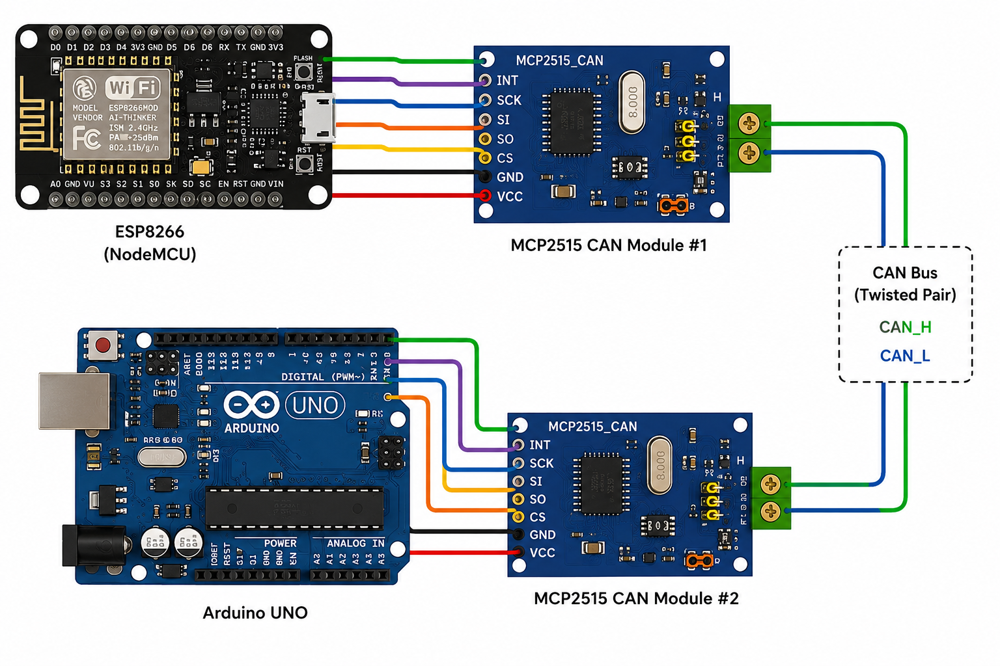
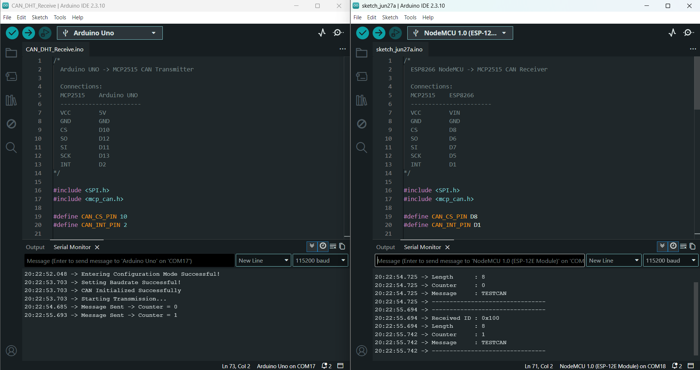

# Arduino to ESP8266 CAN Communication Testing

## 📖 Project Overview

This project demonstrates **CAN (Controller Area Network) communication** between an **Arduino Uno** and an **ESP8266 NodeMCU** using **two MCP2515 CAN Bus modules**.

The objective of this project is to establish reliable communication over the CAN Bus before implementing the final DHT22-based monitoring system.

The Arduino Uno acts as the **CAN Transmitter**, periodically sending CAN messages containing a counter value and a predefined text message. The ESP8266 acts as the **CAN Receiver**, receives the CAN frame, decodes the transmitted data, and displays it on the Serial Monitor.

---

# 🎯 Objectives

* Establish CAN Bus communication between Arduino Uno and ESP8266.
* Interface MCP2515 CAN controllers with both devices.
* Transmit CAN messages from Arduino to ESP8266.
* Receive and decode CAN frames successfully.
* Validate communication before developing the final application.

---

# ✨ Features

* CAN Bus communication using MCP2515 controllers
* Arduino Uno as CAN Transmitter
* ESP8266 as CAN Receiver
* Periodic message transmission every 1 second
* Counter value included in every transmitted frame
* Real-time monitoring using Serial Monitor
* Reliable CAN communication at **500 kbps**

---

# 🛠 Hardware Components

| Component          |    Quantity |
| ------------------ | ----------: |
| Arduino Uno        |           1 |
| ESP8266 NodeMCU    |           1 |
| MCP2515 CAN Module |           2 |
| Breadboard         |           1 |
| Jumper Wires       | As required |
| USB Cable          |           2 |

---

# 💻 Software Requirements

* Arduino IDE
* MCP_CAN Library
* SPI Library
* ESP8266 Board Package

---

# 🔌 Hardware Connections

## Arduino Uno → MCP2515

| MCP2515 | Arduino Uno |
| ------- | ----------- |
| VCC     | 5V          |
| GND     | GND         |
| CS      | D10         |
| SO      | D12         |
| SI      | D11         |
| SCK     | D13         |
| INT     | D2          |

---

## ESP8266 NodeMCU → MCP2515

| MCP2515 | ESP8266 |
| ------- | ------- |
| VCC     | VIN     |
| GND     | GND     |
| CS      | D8      |
| SO      | D6      |
| SI      | D7      |
| SCK     | D5      |
| INT     | D1      |

---

# ⚙️ CAN Configuration

| Parameter         | Value       |
| ----------------- | ----------- |
| CAN Speed         | 500 kbps    |
| Crystal Frequency | 8 MHz       |
| CAN Mode          | Normal Mode |
| CAN Identifier    | 0x100       |
| Data Length       | 8 Bytes     |
| Baud Rate         | 115200      |

---

# 📦 CAN Data Format

Each CAN frame consists of **8 bytes**.

| Byte   | Description   |
| ------ | ------------- |
| Byte 0 | Counter Value |
| Byte 1 | T             |
| Byte 2 | E             |
| Byte 3 | S             |
| Byte 4 | T             |
| Byte 5 | C             |
| Byte 6 | A             |
| Byte 7 | N             |

The transmitted message is:

```text
TESTCAN
```

---

# 🔄 Working Principle

1. Arduino Uno initializes the MCP2515 CAN controller.
2. ESP8266 initializes its MCP2515 CAN controller.
3. Arduino transmits one CAN frame every second.
4. The CAN frame contains:

   * Counter value
   * Text message **"TESTCAN"**
5. ESP8266 continuously monitors the CAN Bus.
6. When a frame is received, it reads:

   * CAN Identifier
   * Data Length
   * Counter Value
   * Message
7. The received information is displayed on the Serial Monitor.

---

# 📡 Communication Flow

```text
Arduino Uno
     │
     ▼
MCP2515 CAN Module
     │
══════ CAN Bus ══════
     │
MCP2515 CAN Module
     ▼
ESP8266 NodeMCU
     │
     ▼
Serial Monitor
```

---

# 📂 Project Structure

```text
Arduino_To_ESP8266_Test
│
├── Arduino_Code
├── ESP8266_Code
├── Circuit_Diagram
├── Images
└── README.md
```

---

# 📷 Circuit Diagram


---

# 📸 Output



---

# 📊 Sample Output

## Arduino Uno

```text
CAN Initialized Successfully

Starting Transmission...

Message Sent -> Counter = 0

Message Sent -> Counter = 1

Message Sent -> Counter = 2
```

---

## ESP8266

```text
--------------------------------

Received ID : 0x100

Length      : 8

Counter     : 0

Message     : TESTCAN

--------------------------------
```

---

# ✅ Results

The communication test was successfully completed between the Arduino Uno and ESP8266 using two MCP2515 CAN Bus modules. The Arduino transmitted a CAN frame every second with CAN Identifier **0x100**, while the ESP8266 correctly received and decoded the transmitted frames. The received counter value and message **"TESTCAN"** matched the transmitted data, confirming reliable CAN Bus communication.

This successful communication test served as the foundation for the main DHT22 temperature monitoring project.

---

# 📚 Learning Outcomes

* CAN Bus Communication
* MCP2515 CAN Controller Interfacing
* SPI Communication
* Arduino Programming
* ESP8266 Programming
* CAN Frame Transmission
* CAN Frame Reception
* Embedded Systems Development
* Communication Debugging

---

# 🚀 Future Scope

The validated CAN communication developed in this project is extended in the next project to transmit real-time temperature and humidity data from a DHT22 sensor. The ESP8266 processes the received sensor values and activates an LED whenever the measured temperature exceeds a predefined threshold.
